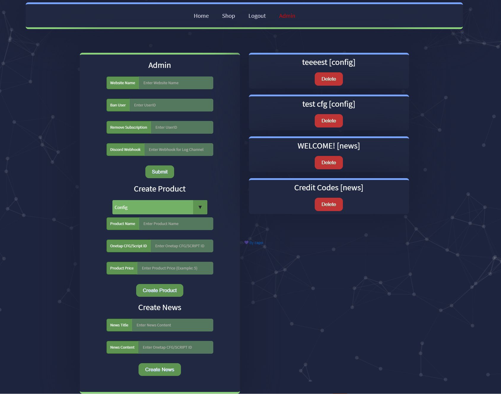
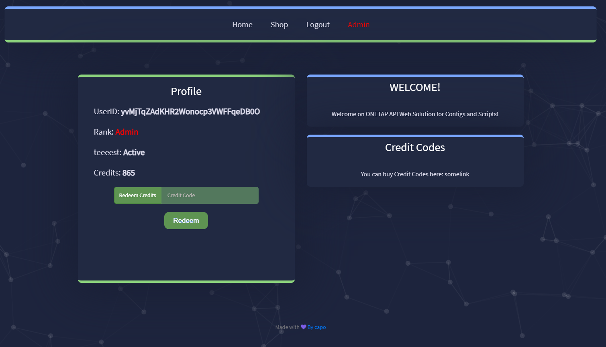
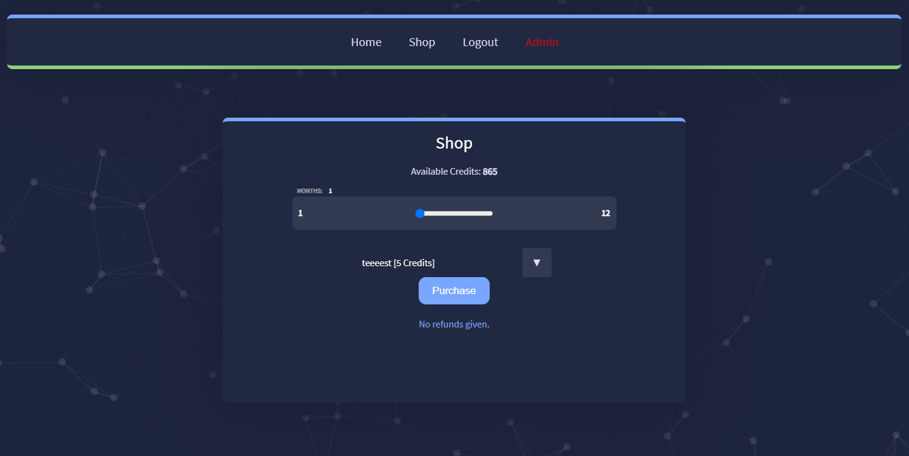
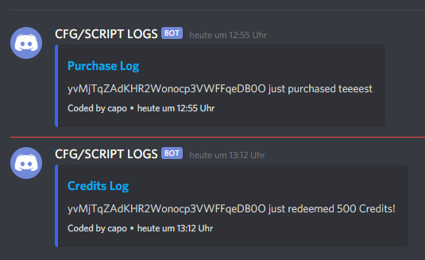

# Onetap Cloud Web Solution
> Config and Script Distribution System

Onetap Cloud Web Solution allows users to purchase and access COnfigs/Scripts of the vendor easily, with Discord Logging etc.
For the Vendors/Owners the Solution provides an Admin Panel and an easy management of the whole Distribution.



The Main Page display the User Profile, News and Active Subscriptions.



The Shop is fully automated and delivers the Invite Link to the Configs/Scripts immediatly.



Purchases / Code usages are logged into ur desired Discord Channel/Server.



The Account System is completly Anonymous, no IP's are logged nor are any personal Informations required. Username are auto generated.
## Installation

Requirements:

```sh
webserver :) and Mysql db
```

Setup 
- Upload all files to ur document root
- import the given db setup to ur phpmyadmin (capo.sql)
- change all 3 DB creds and Onetap API Creds in db.php in the root
- set the environement variables in (environement.php) -> You have to create a google recaptcha and insert these variabes https://www.google.com/recaptcha/admin/ (V2 Im not a robot)
- Register youre account and change youre rank in Users table to 100 so you have admin (admin panel) access
- Now feel free to use youre admin panel to create products and news etc.

## Release History

* 0.0.1
    * Initial Release

## Meta

made by capo - https://www.youtube.com/c/capomodding

Distributed under the XYZ license. See ``LICENSE`` for more information.

[https://github.com/imcapo](https://github.com/dbader/)

CSS Inspired by a codepen i cant remember!

## Future Features
- Ticket System
- Adding all possible features Onetap Cloud Api provides

